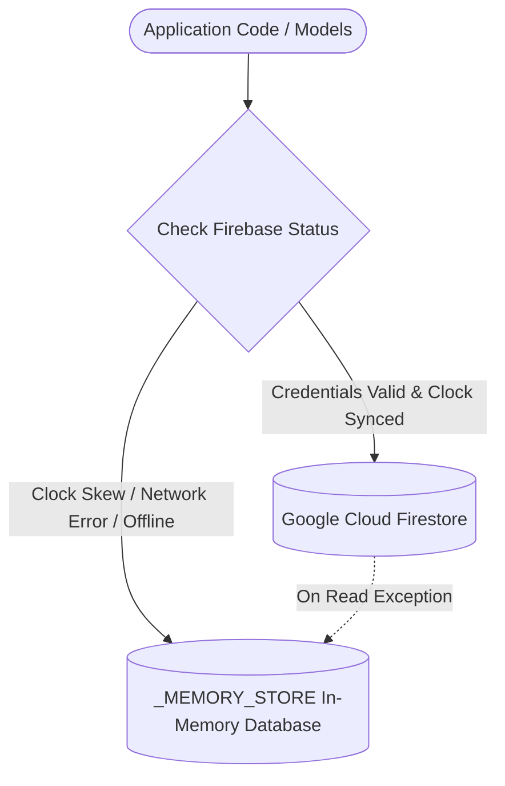

# Presenova: AI Presentation Platform
## Complete Technical Specification, Architecture Manual & Deployment Guide
**Release 1.1.0 (Post-Deployment Audit Edition) — Final Year Project (FYP)**

---

## 1. Executive Summary & Abstract

**Presenova** is an enterprise-grade, multi-modal AI presentation rehearsal, analysis, and real-time coaching platform. It bridges the gap between subjective, inconsistent human critiques and automated, deterministic, quantitative telemetry. The platform analyzes slide decks, vocal and speech acoustics, real-time webcam gaze and posture composure, interactive rehearsal practice, academic thesis defense readiness, and automated presentation synthesis.

### Supported Client Targets:
- **Web Application**: React 18, TypeScript, Tailwind CSS, Vite (Optimized for Vercel deployment).
- **Desktop Application**: Electron 31 cross-platform desktop shell with native Google OAuth integration.
- **Mobile Application**: Flutter SDK (Android & iOS) with native camera, microphone, and WebSocket channels.
- **Central API Hub**: Python Flask, Flask-SocketIO (Gevent/EngineIO), Firebase Firestore (with instant local in-memory fallback), and Flask-JWT-Extended.
- **Deterministic Machine Learning & RAG Engine**: Scikit-Learn `RandomForestRegressor`, SentenceTransformers (`all-MiniLM-L6-v2`), FAISS vector index, and `spaCy` NLP linguistic transformation pipelines (functioning completely offline without external LLM dependencies for baseline scoring).
- **Vision & Speech Perception**: MediaPipe Face Mesh (478-landmark iris refinement tracking), OpenCV Haar Cascades, and Groq Whisper (`whisper-large-v3` on Groq LPU hardware).

---

## 2. Technology Stack & Architecture

### 2.1 Technology Matrix

| Layer | Technologies & Frameworks | Purpose & Implementation Details |
| :--- | :--- | :--- |
| **Backend API Hub** | Python 3.10+ / Flask 3.0 | Modular RESTful API with Blueprints, CORS, strict rate limiting, and JWT security |
| **Real-Time Streaming** | Flask-SocketIO / Gevent / EngineIO | Bi-directional, low-latency WebSocket connection (`/ws/live-session`) for camera frames and audio chunks |
| **Identity & Database** | Firebase Auth & Cloud Firestore | Dual-layer persistence with Firestore remote cloud and thread-locked in-memory fallback (`_MEMORY_STORE`) |
| **Speech-to-Text (STT)** | Groq Whisper API (`whisper-large-v3`) | Sub-400ms speech transcription on LPU hardware with `timeout=4.0s` and rate-limit circuit breakers |
| **Computer Vision Engine** | MediaPipe Face Mesh + OpenCV | 478-landmark iris refinement tracking (landmarks 468–477) for gaze deviation and EAR blink gating |
| **Classical ML Scoring** | Scikit-Learn / Pickle (`trained_weights.pkl`) | Offline `RandomForestRegressor` ensemble predicting 7Cs presentation traits from 19 linguistic features |
| **Vector RAG Engine** | SentenceTransformers + FAISS (`IndexFlatIP`) | 200-word passage chunking, cosine similarity retrieval, and academic viva question generation |
| **NLP & Linguistic Rules**| `spaCy` (`en_core_web_sm`) & LanguageTool Cloud | Dependency parsing (`nsubjpass`), passive-to-active conversion, and grammar pre-analysis |
| **Presentation Engine** | `python-pptx`, `pypdf`, `python-docx`, Matplotlib | PPTX slide parser, layout rewriter, chart generator, and editorial image embedder |
| **Frontend Web** | React 18, TypeScript, Tailwind CSS, Vite | Responsive SPA with Recharts analytics, diff previewers, and camera/audio recording hooks |
| **Desktop Runtime** | Electron 31 | Chromium runtime wrapping the React web frontend with native Google OAuth redirect handling |
| **Mobile Application** | Flutter SDK (Dart) | Native mobile client with Provider state management, Dio HTTP client, and Socket.IO client |

---

### 2.2 System Architecture Diagram

```mermaid
graph TD
    ClientWeb([React 18 / Vite Web App]) <-->|REST API / JWT| FlaskAPI[Flask Central API Hub main.py]
    ClientDesktop([Electron Desktop App]) <-->|REST API / JWT| FlaskAPI
    ClientMobile([Flutter Mobile App]) <-->|REST API / JWT| FlaskAPI
    ClientWeb <-->|WSS WebSockets| SocketEngine[Socket.IO Engine phase_live.py]
    ClientMobile <-->|WSS WebSockets| SocketEngine

    subgraph Backend Blueprints
        FlaskAPI --> AuthBP[Auth auth.py]
        FlaskAPI --> DocBP[Document Analyzer phase_two.py]
        FlaskAPI --> SpeechBP[Speech Analyzer phase_four.py]
        FlaskAPI --> CoachBP[AI Coach phase_five.py]
        FlaskAPI --> RewriterBP[Rewriter routes/presentation_rewriter.py]
        FlaskAPI --> GeneratorBP[Generator routes/presentation_generator.py]
        FlaskAPI --> VivaBP[Viva Generator routes/question_generator.py]
    end

    subgraph Processing & Local ML Pipelines
        DocBP --> TextExtractor[services/text_extractor.py]
        DocBP --> OfflineNLP[nlp_module RandomForest Scorer]
        DocBP --> SubAnalyzers[7 Deep Sub-Analyzers: Design, Stats, Consistency, etc.]
        SpeechBP --> GroqWhisper[Groq Whisper STT API timeout=4s]
        SocketEngine --> MediaPipeVision[MediaPipe Per-Session FaceMesh & Iris]
        CoachBP --> CoachIntent[TF-IDF + LogisticRegression Intent Engine]
        RewriterBP --> SpaCyRewriter[spaCy Rule-Based Rewrite Engine]
        GeneratorBP --> PPTXBuilder[services/presentation_generator.py Layout Engine]
        VivaBP --> FAISSVector[FAISS IndexFlatIP + SentenceTransformers]
    end

    subgraph Dual Persistence Layer
        AuthBP --> DBRouter[(models.py Database Router)]
        DocBP --> DBRouter
        SpeechBP --> DBRouter
        DBRouter -->|Primary| Firestore[(Google Cloud Firestore)]
        DBRouter -->|Instant Fallback| MemoryDB[(Thread-Locked In-Memory Store)]
    end
```



---

## 3. Pre-Deployment Audit Resolutions (Release 1.1.0)

In accordance with the **Presenova Pre-Deployment Audit Report**, the following 14 Critical and High severity issues were systematically resolved:

1. **[ISSUE-14] Database Upload Records Point to Deleted Temporary Files**
   - **Resolution**: Uploaded presentation and audio files are persisted to permanent storage directories (`instance/uploads/<uuid>/<filename>`) before creating `Upload` database records. Deletion in `finally` blocks was removed for permanent records.
2. **[ISSUE-13] Missing Magic Byte File Signature Verification**
   - **Resolution**: `validate_file_content()` was extended to verify binary signatures (`PK\x03\x04` for PPTX/DOCX, `%PDF-` for PDF, `\xd0\xcf\x11\xe0` for DOC, null-byte rejection for TXT) and called before parsing in `phase_two.py`.
3. **[ISSUE-01] Global MediaPipe Instance Concurrency Race Condition**
   - **Resolution**: Replaced the global `face_mesh_detector` with a per-session detector instance stored in `_MEMORY_STORE["presentation_sessions"][session_id]["detector"]` synchronized via `threading.Lock`. Detectors are closed and released upon socket disconnect and session submission.
4. **[ISSUE-02] Hardcoded `localhost:5000` in Frontend `healthCheck()`**
   - **Resolution**: Derived the root health check URL dynamically using `API_BASE_URL.replace(/\/api\/?$/, '') || window.location.origin` in `frontend/src/services/api.ts`.
5. **[ISSUE-03] Socket.IO Host URL Fallback Fails on Relative Vercel Base Paths**
   - **Resolution**: Added `VITE_SOCKET_URL` environment variable support and fallback to `window.location.origin` when `VITE_API_BASE_URL` is a relative path in `frontend/src/hooks/useLiveSession.ts`.
6. **[ISSUE-04] JWT Error Handlers Not Registered on JWTManager Instance**
   - **Resolution**: Bound `@jwt.expired_token_loader`, `@jwt.invalid_token_loader`, `@jwt.unauthorized_loader`, and `@jwt.revoked_token_loader` to the `jwt = JWTManager(app)` instance, returning standardized JSON: `{"success": false, "error": "ShortErrorCode", "message": "..."}`.
7. **[ISSUE-05] Missing Token Refresh Endpoint**
   - **Resolution**: Implemented `POST /api/auth/refresh` (and `/auth/refresh` compatibility rule) decorated with `@jwt_required(refresh=True)` returning new access tokens. Included refresh tokens in signup, login, and Firebase auth responses.
8. **[ISSUE-06] OS Temp File Leak in Live Audio Chunk Processing**
   - **Resolution**: Guarded `os.remove(temp_audio_path)` inside a `finally` block with existence verification and `OSError` handling in `phase_live.py`.
9. **[ISSUE-07] Groq Whisper API Missing Timeout and Rate-Limit Handling**
   - **Resolution**: Initialized Groq clients with `timeout=4.0` in both `phase_live.py` and `phase_four.py`. Wrapped transcription calls in `try/except (groq.RateLimitError, groq.APITimeoutError)` with graceful degraded fallbacks.
10. **[ISSUE-09] Unhandled Promise Rejection in Live Microphone Capture**
    - **Resolution**: Added `.catch()` error handler to `navigator.mediaDevices.getUserMedia({ audio: true })` in `frontend/src/hooks/useLiveSession.ts`, updating UI error state and halting streaming cleanly.
11. **[ISSUE-10] Live Audio Stream Tracks Never Released on Session Stop**
    - **Resolution**: Stored the active microphone `MediaStream` in `audioStreamRef` and invoked `track.stop()` on all tracks inside `stopMediaStreaming()`.
12. **[ISSUE-11] Video Capture Permission Denial Silent to Parent UI**
    - **Resolution**: Added `onError` prop to `VideoCapture.tsx`, surfaced error messages inside the component overlay, and rendered high-visibility alert banners in `LiveCoach.tsx`.
13. **[ISSUE-12] Unauthenticated & Unbounded Question Generator Endpoint**
    - **Resolution**: Added `@rate_limit(limit_authenticated=15, limit_guest=3)` to `/api/questions/generate` and clamped question count: `num_questions = max(3, min(30, int(...)))`.
14. **[ISSUE-15] Incomplete Frontend Environment Variable Template (`.env.example`)**
    - **Resolution**: Populated `frontend/.env.example` with complete configuration keys for `VITE_API_BASE_URL`, `VITE_SOCKET_URL`, and all 7 Firebase environment variables.

---

## 4. Comprehensive Module Breakdown

### 4.1 Document Analysis Engine (`phase_two.py`)
- **Route**: `POST /api/analyze-document`
- **Capabilities**:
  - Secure permanent storage in `instance/uploads/<uuid>/<filename>` with magic byte verification.
  - Multi-format extraction for `.pptx` (XML shapes & tables), `.pdf` (PyPDF text streams), `.docx` (word/document.xml), and `.txt`.
  - Offline 7Cs presentation trait evaluation via `ai_evaluator.py` combined with Scikit-Learn `RandomForestRegressor`.
  - **7 Deep Sub-Analyzers**: Structural statistics, visual balance, sentiment & tone, pacing & transitions, delivery impact, narrative structure, and duplicate slide detection.

### 4.2 Speech Delivery Analyzer (`phase_four.py`)
- **Routes**: `POST /api/analyze-audio`, `POST /api/analyze-speech`
- **Capabilities**:
  - Accepts raw audio formats (`.wav`, `.mp3`, `.m4a`, `.ogg`, `.webm`, `.flac`) or pre-transcribed text.
  - Sub-400ms speech-to-text via Groq Whisper (`whisper-large-v3`, `timeout=4.0s`).
  - Speaking pace calculation in Words Per Minute (WPM) with optimal 120–160 WPM targeting.
  - Filler word frequency counter (`um`, `uh`, `like`, `you know`, `basically`, `actually`, `kind of`) and repetition detector.
  - Complete 7Cs speech scorecard generation and permanent audio archiving.

### 4.3 Real-Time Live Coaching & Teleprompter (`phase_live.py`)
- **WebSocket Namespace**: `/ws/live-session`
- **REST Endpoints**: `POST /api/presentation/submit`, `GET /api/presentation/history`, `GET /api/presentation/vision-status`
- **Capabilities**:
  - Per-session MediaPipe Face Mesh detector with iris refinement landmarks (468–477) for gaze deviation tracking.
  - Head pose estimation and posture composure monitoring with OpenCV Haar cascade fallback.
  - 3-second audio chunk streaming with real-time filler word detection and WPM tracking.
  - **Dynamic Academic Cross-Examination**: Automatic AI panelist interruption triggered on high filler density or periodic intervals, posing sharp defense questions with senior professor AI grading.
  - Renormalized scoring formula weighting Visual Presence (35%), Vocal Delivery (35%), and Content/Q&A Quality (30%).

### 4.4 AI Practice Coach & State Machine (`phase_five.py`)
- **Route**: `POST /api/practice-chat`
- **Capabilities**:
  - Intent classification using TF-IDF vectorizer and `LogisticRegression` (`services/coach_intent_engine.py`).
  - Recognizes user intent states: `viva_prep`, `slide_critique`, `pacing_feedback`, `general_coaching`.
  - Maintains conversation context and returns actionable, pedagogical coaching guidance.

### 4.5 Slide Deck Generator (`routes/presentation_generator.py`)
- **Routes**: `POST /api/presentation-generator/generate`, `GET /api/presentation-generator/download/<filename>`
- **Capabilities**:
  - Transforms raw text or structured outlines into professional, branded `.pptx` decks.
  - 10 professional layouts: Cover, Split Two-Column, 3-Card Grid, Metric Callouts, Process Timeline, Matrix Comparison, and Data Visualizations.
  - Automatic chart generation (Bar, Line, Pie) rendered via Matplotlib and embedded natively into PPTX slides.

### 4.6 Viva Defense Question Generator (`routes/question_generator.py`)
- **Route**: `POST /api/questions/generate`
- **Capabilities**:
  - Vector retrieval-augmented generation (RAG) using SentenceTransformers (`all-MiniLM-L6-v2`) and FAISS (`IndexFlatIP`).
  - Chunks presentation transcripts into 200-word passages and queries top academic defense vectors.
  - Generates tough, conceptual panelist questions categorized by Methodology, Claims, Architecture, and Edge Cases.
  - Clamped between 3 and 30 questions with strict IP rate limiting.

### 4.7 Slide Deck Rewriter (`routes/presentation_rewriter.py`)
- **Routes**: `POST /api/rewrite/analyze`, `POST /api/rewrite/apply`, `POST /api/rewrite/download`
- **Capabilities**:
  - Rule-based passive-to-active voice transformation using `spaCy` dependency tree parsing (`nsubjpass`).
  - 6x6 rule compliance engine (maximum 6 bullet points per slide, 6 words per bullet).
  - Generates downloadable, redesigned PPTX decks with side-by-side before/after comparison previews.

---

## 5. Database & Identity Architecture

### 5.1 Dual-Engine Persistence Model (`models.py`)

Presenova implements a resilient database layer that automatically handles cloud failures, clock skew, and expired service account credentials without crashing:



1. **Primary: Cloud Firestore**:
   - Collections: `users`, `uploads`, `reports`, `presentation_sessions`, `historical_reports`.
   - Initialized using `firebase-service-account.json`.
2. **Secondary: Thread-Safe In-Memory Store (`_MEMORY_STORE`)**:
   - Synchronized dictionary store with automatic timestamping and UUID generation.
   - Activates instantly (< 0.5s) if Google returns `invalid_grant` or network is offline.

---

## 6. Complete REST & WebSocket API Reference

### 6.1 Authentication Endpoints (`/api/auth`)

| Endpoint | Method | Auth Required | Description | Request Body / Params | Response Schema |
| :--- | :---: | :---: | :--- | :--- | :--- |
| `/api/auth/signup` | `POST` | None | Register new user account | `{"name": "...", "email": "...", "password": "..."}` | `{"status": "success", "user": {...}, "access_token": "...", "refresh_token": "..."}` |
| `/api/auth/login` | `POST` | None | Authenticate with credentials | `{"email": "...", "password": "..."}` | `{"status": "success", "user": {...}, "access_token": "...", "refresh_token": "..."}` |
| `/api/auth/firebase-login` | `POST` | None | Verify Firebase Google ID token | `{"id_token": "..."}` | `{"status": "success", "user": {...}, "access_token": "...", "refresh_token": "..."}` |
| `/api/auth/refresh` | `POST` | Bearer (Refresh) | Issue new access token | Header: `Authorization: Bearer <refresh_token>` | `{"success": true, "access_token": "...", "message": "..."}` |
| `/api/auth/me` | `GET` | Bearer (Access) | Fetch current user profile | Header: `Authorization: Bearer <access_token>` | `{"status": "success", "user": {...}}` |
| `/api/auth/history` | `GET` | Optional | Retrieve analysis history | Query: `?page=1` | `{"status": "success", "reports": [...]}` |

### 6.2 Document Analysis Endpoints (`/api`)

| Endpoint | Method | Auth Required | Description | Request Payload | Response Schema |
| :--- | :---: | :---: | :--- | :--- | :--- |
| `/api/analyze-document` | `POST` | Optional | Upload and analyze slide deck | `multipart/form-data`: `file: <binary>` | `{"overall_score": 85, "seven_cs_scores": {...}, "slides": [...]}` |
| `/api/compare-documents` | `POST` | Optional | Compare two slide versions | `{"v1_text": "...", "v2_text": "..."}` | `{"score_difference": 15, "key_improvements": [...]}` |

### 6.3 Speech Analysis Endpoints (`/api`)

| Endpoint | Method | Auth Required | Description | Request Payload | Response Schema |
| :--- | :---: | :---: | :--- | :--- | :--- |
| `/api/analyze-audio` | `POST` | Optional | Upload WAV/MP3 speech audio | `multipart/form-data`: `file: <audio>`, `duration_seconds: 60` | `{"status": "success", "speech_speed_wpm": 138, "filler_words_count": 3, "transcript": "..."}` |
| `/api/analyze-speech` | `POST` | Optional | Analyze raw transcript text | `{"text": "...", "duration_seconds": 60}` | `{"status": "success", "clarity_score": 90, ...}` |

### 6.4 Live Presentation Teleprompter (`/api/presentation` & WebSocket)

| Endpoint / Event | Protocol | Description | Payload |
| :--- | :---: | :--- | :--- |
| `GET /api/presentation/vision-status` | HTTP GET | Query native CV availability | `{"opencv_available": true, "mediapipe_mode": "tasks", ...}` |
| `POST /api/presentation/submit` | HTTP POST | Finalize session and generate report | `{"session_id": "uuid"}` |
| `GET /api/presentation/history` | HTTP GET | Historical scorecards for topic | `?topic=Thesis+Defense` |
| `connect` | WebSocket | Connect to `/ws/live-session` | Empty handshake |
| `start_session` | WebSocket | Initialize rehearsal session | `{"user_id": "...", "topic": "..."}` |
| `video_frame` | WebSocket | Stream 3fps JPEG frame | `{"session_id": "...", "frame": "data:image/jpeg;base64,..."}` |
| `realtime_feedback` | WebSocket (Server) | Real-time gaze & posture telemetry | `{"face_detected": true, "eye_contact": 85, "posture": 90, "hint": "..."}` |
| `audio_chunk` | WebSocket | Stream 3-second WebM voice chunk | `{"session_id": "...", "audio": "data:audio/webm;base64,..."}` |
| `interruption_trigger` | WebSocket (Server) | Panelist cross-question trigger | `{"question": "...", "evaluator_name": "Prof. Eleanor Vance"}` |
| `submit_answer` | WebSocket | Submit student answer | `{"session_id": "...", "answer": "..."}` |
| `interruption_resolved` | WebSocket (Server) | Professor grading and critique | `{"status": "success", "score": 88, "feedback": "..."}` |

### 6.5 AI Slide Generation, Rewriting & Viva Endpoints

| Endpoint | Method | Auth Required | Description |
| :--- | :---: | :---: | :--- |
| `/api/questions/generate` | `POST` | Rate-Limited | Generate viva defense questions via FAISS vector RAG |
| `/api/presentation-generator/generate`| `POST` | Optional | Generate complete PowerPoint deck from topic/outline |
| `/api/presentation-generator/download/<file>`| `GET` | None | Download generated PPTX presentation |
| `/api/rewrite/analyze` | `POST` | Optional | Analyze slide text for passive voice and 6x6 rule |
| `/api/rewrite/apply` | `POST` | Optional | Apply automated linguistic rewrites |
| `/api/practice-chat` | `POST` | Optional | Chat with AI practice coach |

---

## 7. Step-by-Step Installation & Run Guide

### 7.1 Prerequisites
- **Python**: Version 3.10, 3.11, or 3.12 (64-bit).
- **Node.js**: Version 18+ or 20+ LTS with `npm`.
- **Git**: Installed and available in PATH.
- **Optional**: Flutter SDK (if running mobile client).

---

### 7.2 Backend Setup & Execution

1. **Navigate to the repository root**:
   ```bash
   cd "c:\Users\Muhammad\Downloads\FYP Final_1.2"
   ```

2. **Activate Virtual Environment** (or create one):
   ```bash
   python -m venv venv
   # Windows PowerShell:
   .\venv\Scripts\Activate.ps1
   # Windows CMD:
   .\venv\Scripts\activate.bat
   ```

3. **Install Dependencies**:
   ```bash
   pip install -r requirements.txt
   ```

4. **Verify Environment Variables (`.env`)**:
   Ensure `.env` exists in the root directory with at least:
   ```env
   FLASK_ENV=development
   SECRET_KEY=presenova-secure-jwt-secret-key-32-chars
   JWT_SECRET_KEY=presenova-secure-jwt-secret-key-32-chars
   GROQ_API_KEY=your-groq-api-key
   GEMINI_API_KEY=your-gemini-api-key
   CORS_ORIGINS=http://localhost:3000,http://localhost:5173
   ```

5. **Start the Backend Server**:
   ```bash
   python main.py
   ```
   *The server starts on `http://127.0.0.1:5000` with WebSocket support enabled.*

---

### 7.3 Frontend Web Setup & Execution

1. **Navigate to the frontend directory**:
   ```bash
   cd frontend
   ```

2. **Install Node Dependencies**:
   ```bash
   npm install
   ```

3. **Verify Frontend Environment Variables (`frontend/.env`)**:
   Ensure `frontend/.env` is configured (mirrored from `frontend/.env.example`):
   ```env
   VITE_API_BASE_URL=http://localhost:5000/api
   VITE_SOCKET_URL=http://localhost:5000
   VITE_FIREBASE_API_KEY=your-firebase-api-key
   VITE_FIREBASE_AUTH_DOMAIN=your-app.firebaseapp.com
   VITE_FIREBASE_PROJECT_ID=your-app
   VITE_FIREBASE_STORAGE_BUCKET=your-app.firebasestorage.app
   VITE_FIREBASE_MESSAGING_SENDER_ID=1234567890
   VITE_FIREBASE_APP_ID=1:1234567890:web:abcde12345
   ```

4. **Run the Frontend Development Server**:
   ```bash
   npm run dev
   ```
   *The frontend starts on `http://localhost:3000` with fast HMR.*

---

### 7.4 Running the Desktop Client (Electron)

1. From the `frontend/` directory, ensure dev server is running, then in a separate terminal:
   ```bash
   cd frontend
   npm run electron:dev
   ```

---

### 7.5 Running the Mobile Client (Flutter)

1. Open a new terminal in `mobile/`:
   ```bash
   cd mobile
   flutter pub get
   flutter run
   ```

---

## 8. Cloud & Production Deployment Guide

### 8.1 Frontend Deployment to Vercel

1. Push code to your GitHub repository.
2. In [Vercel Dashboard](https://vercel.com):
   - Click **"Add New Project"** $\rightarrow$ Import your Presenova repository.
   - Set **Root Directory** to `frontend`.
   - Set **Framework Preset** to `Vite`.
3. Configure **Environment Variables** in Vercel:
   ```env
   VITE_API_BASE_URL=https://your-backend-domain.com/api
   VITE_SOCKET_URL=https://your-backend-domain.com
   VITE_FIREBASE_API_KEY=AIzaSy...
   VITE_FIREBASE_AUTH_DOMAIN=...
   VITE_FIREBASE_PROJECT_ID=...
   VITE_FIREBASE_STORAGE_BUCKET=...
   VITE_FIREBASE_MESSAGING_SENDER_ID=...
   VITE_FIREBASE_APP_ID=...
   ```
4. Click **Deploy**. Vercel will build and serve the optimized single-page application globally via edge CDN.

---

### 8.2 Backend Deployment (Render / Railway / VPS / Docker)

1. **Procfile** (for Render / Railway / Heroku):
   ```procfile
   web: gunicorn --worker-class geventwebsocket.gunicorn.workers.GeventWebSocketWorker -w 1 --bind 0.0.0.0:$PORT main:app
   ```
2. **Production Environment Variables**:
   ```env
   FLASK_ENV=production
   SECRET_KEY=generate-strong-64-character-random-key
   JWT_SECRET_KEY=generate-strong-64-character-random-key
   GROQ_API_KEY=gsk_...
   GEMINI_API_KEY=AIzaSy...
   CORS_ORIGINS=https://your-presenova.vercel.app
   ```
3. **Persistent Volume**:
   - Mount a persistent volume at `/app/instance` to retain user uploads (`instance/uploads/`).

---

## 9. Test Verification Catalog

The Presenova codebase contains extensive automated test coverage across all subsystems:

```bash
# Run backend connectivity and routing verification
python tests/test_backend_connectivity.py

# Run offline deterministic 7Cs evaluator and ML pipeline
$env:PYTHONPATH="."; python tests/test_offline_nlp.py

# Run audit resolution verification
python .gemini/antigravity-ide/brain/52ea915f-0baf-4bdf-9a70-ff2cceb07af1/scratch/test_audit_fixes.py

# Run frontend TypeScript typecheck
cd frontend
npx tsc --noEmit
```

### Verification Matrix:
- **`test_backend_connectivity.py`**: 6/6 tests passing (Health, Document Analysis, Speech Analysis, Practice Chat, Comparison, Frontend Config).
- **`test_offline_nlp.py`**: 8/8 test suites passing (Document, Speech, Live, RAG Consistency, Viva Defense, Intent Classifier, spaCy Rule Rewriter).
- **`npx tsc --noEmit`**: 0 errors, 100% type-safe compilation.

---

## 10. Troubleshooting & Common Pitfalls

| Symptom | Probable Cause | Immediate Resolution |
| :--- | :--- | :--- |
| `Firebase credentials verification failed (invalid_grant)` | Windows local system clock skew | Open Windows **Date & Time Settings** $\rightarrow$ Toggle **"Set time automatically"** to OFF then ON $\rightarrow$ Click **"Sync now"**. Backend automatically operates in resilient local fallback mode regardless. |
| `Camera access denied or device is in use` | Browser permission blocked or Zoom/Teams locking webcam | Allow camera in Chrome/Edge URL lock icon; quit background video apps. Component displays friendly warning banner. |
| `Microphone access error: Permission denied` | Microphone access declined by user | Click browser URL bar lock icon $\rightarrow$ Allow Microphone. Session stops gracefully without freezing. |
| `Unsupported file format` | Uploading non-presentation extension | Platform accepts `.pptx`, `.pdf`, `.docx`, `.doc`, `.txt` for slides, and `.wav`, `.mp3`, `.m4a`, `.webm` for audio. |
| `Groq Whisper rate limit / timeout` | Transient network lag or rate limits | System applies a 4-second timeout and returns a graceful degraded scorecard without crashing. |

---

*Presenova AI Presentation Platform — Release 1.1.0 Comprehensive Documentation*
